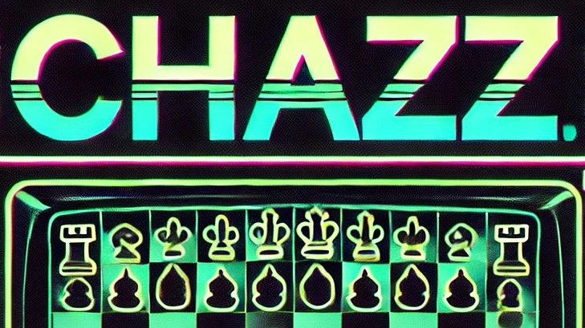

# CHAZZ



 ... is an esoteric programming language or more precisely its interpreter.

## Table of Contents
- [CHAZZ](#chazz)
  - [Table of Contents](#table-of-contents)
  - [Introduction](#introduction)
  - [Usage](#usage)
  - [Horizontally Relative Increment/Decrement](#horizontally-relative-incrementdecrement)
- [Manual](#manual)
  - [.FEN explained](#fen-explained)
    - [structure of FEN](#structure-of-fen)
    - [utilized .FEN fields](#utilized-fen-fields)
    - [chess pieces/commands](#chess-piecescommands)
  - [An Example](#an-example)
    - [Interpretation](#interpretation)
    - [Step by Step Explanation](#step-by-step-explanation)
- [FAQ](#faq)
- [Outlook/Possible Additions](#outlookpossible-additions)

## Introduction
This interpreter was created for the *Computermusic and Multimedia* class at IEM Graz. The basic guidelines were to implement a Turing complete programming language's interpreter.

## Usage
After compiling `chazz.c` call the interpreter `chazz` with any pre-created `.fen`file as follows. Try out given examples.
```
./chazz ./examples/tutorial.fen
```
A flag can be set to display the chess board as `.html` as follows.
```
./chazz ./examples/tutorial.fen true
```

## Horizontally Relative Increment/Decrement

As important and omnipresent pawns are on traditional chess boards, as interesting is their presence as well as their exact horizontal position for **CHAZZ**. Therefore a pawn will be interpreted as either increment (`P`) or decrement (`p`) of its horizontal position's binary value. A line of pawns on the traditional 8 by 8 chess board `PPPPPPPP` is equal to `11111111` and represents 255. **Note:** *While binary is interpreted from left to right e.g.* `2^4 2^3 2^2 2^1 2^0` **CHAZZ** *interprets these values the way it interprets the whole board namely from left to right e.g.* `2^0 2^1 2^2 2^3 2^4`.

# Manual

Logic of a program/prompt is based on placing chess pieces on the chess board represented by a [.FEN](#structure-of-fen) file. Note that most recent update the amount of input commands is not restricted to the classical chess board size (8 by 8) anymore.

## .FEN explained

FEN (Forsyth-Edwards Notation) is a standard notation for describing a particular board position in chess. It is widely used in chess engines, games, and analysis tools to represent a snapshot of a game state. A single line of FEN notation provides all the necessary information to reconstruct a position on a chessboard.

This document explains the structure of FEN, its components, and practical use cases.

---

### structure of FEN

FEN is basically a string describing the current state of a chess board. It consists of six fields, separated by spaces. It has to be mentioned that a .FEN interpreted by **CHAZZ** does not necessarily have to be *valid* in a traditional way since any size of chess board is possible and positions of pieces are not restricted by the parser either. 
```
<Piece Placement> <Active Color> <Castling Rights> <En Passant Target Square> <Halfmove Clock> <Fullmove Number>
```

Each field provides specific information about the chessboard state:

1. **Piece Placement**
   - Represents the placement of pieces on the board, starting from the 8th rank to the 1st rank.
   - Each rank is separated by a `/`.
   - Pieces are represented by letters:
     - Uppercase: white pieces (`K`, `Q`, `R`, `B`, `N`, `P`)
     - Lowercase: black pieces (`k`, `q`, `r`, `b`, `n`, `p`)
   - Empty squares are denoted by numbers (e.g., `3` for three empty squares).

   **Example:** `rnbqkbnr/pppppppp/8/8/8/8/PPPPPPPP/RNBQKBNR`
   (Initial chess position)

2. **Active Color**
   - Indicates whose turn it is to move.
   - `w` for white, `b` for black.

   **Example:** `w` (White to move)

3. **Castling Rights**
   - Denotes which sides have the right to castle.
   - `K` for White kingside, `Q` for White queenside.
   - `k` for black kingside, `q` for black queenside.
   - If no castling rights are available, this field is `-`.

   **Example:** `KQkq` (Both sides can castle kingside and queenside)

4. **En Passant Target Square**
   - The square that can be captured en passant.
   - If no en passant move is possible, this field is `-`.

   **Example:** `e3` (White's pawn moved from e2 to e4, Black can capture on e3)

5. **Halfmove Clock**
   - The number of halfmoves (plies) since the last pawn move or capture.
   - Used to determine the 50-move rule.

   **Example:** `0` (No halfmoves made since last pawn move or capture)

6. **Fullmove Number**
   - The total number of full moves in the game.
   - Increments after Black's move.

   **Example:** `1` (First move of the game)


### utilized .FEN fields

1. **Piece Placement**
   - Contains the majority of information to be interpreted.
2. **Active Color**
   - Determines which color to interpret first. This makes it possible to easily switch between two kinds of logic in one input file. (Check out `example/to_turn.fen`.)
All other fields will be ignored.

---

### chess pieces/commands
| Command | Piece          | Description                         |
|---------|---------------|--------------------------------------|
| P       | white Pawn     | increment binary value relatively to current horizontal position |
| N       | white Knight   | pointer increment                   |
| R       | white Rook     | write to `stdout`                   |
| B       | white Bishop   | begin **loop**                      |
| Q       | white Queen    | push current memory's value to *buffer* |
| K       | white King     | set `1`                             |
| p       | black Pawn     | decrement binary value relatively to current horizontal position |
| n       | black Knight   | pointer decrement                   |
| r       | black Rook     | read from `stdin`                   |
| b       | black Bishop   | end **loop**                        |
| q       | black Queen    | pop *buffer*'s content              |
| k       | black King     | set `0`                             |


## An Example

All commands **CHAZZ** has to offer shall be demonstrated by explaining `examples/tutorial.fen`.

Here is `tutorial.fen`'s content to begin with.
```
4PPQ1/PR6/qPR5/q1PR4/q2PR3/N2PBn2/pRN5/pbKBrRkb w
```

### Interpretation

- **Active Color:** `w` (White to move)

- **Piece Placement:** 
  1. First of all we see `4PP` which represents the character `'0'`. This is used as an offset here and will immediately stored in the *buffer* with `Q` as well as popped from there with `q`. To demonstrate the [*horizontally relative increment*](#horizontally-relative-incrementdecrement) the lines `PR6`, `qPR5`, `q1PR4` and `q2PR3` print the corresponding binary values to each pawn's horizontal position by utilizing `R`.

  | piece(s) | computation | memory cell | value | output |
  |---|---|---|---|---|
  | `4PP`| 2^5 + 2^6 | 0 | 48 | |
  | `PR6` | 48 + 2^0 | 0 | 49 | '1' |
  | `qPR5` | 48 + 2^1 | 0 | 50 | '2' | 
  | `q1PR4` | 48 + 2^2 | 0 | 52 | '4' |
  | `q2PR3` | 48 + 2^3 | 0 | 56 | '8' |

  ---

  2. `N`then performs a *pointer increment* which is then being incremented by 2^4. This represents the *counter* or *loop condition* for the *loop* which is being started with `B`. Inside the *loop* first a *pointer decrement* is performed with `n` followed by a 2^0 decrement with a `p` on the leftmost horizontal position and `R` immediately prints the result before `N` increments the pointer again, `p` decrements th loop's *counter* and as long as this *loop condition* is not equal to `0` the loop will start over.

  3. Once the *counter* is equal to `0` the loop stops and it is set to `1` with `K` starting another loop with `B` which will try receiving user's input from `stdin` with `r` and directly *echo* it with `R` and immediately stop the loop with `b` by setting `0` with `k`.

  ---

  - Here we see how combinations of pieces can construct basic commands that are not directly implemented.
    - `k` in `kb` is basically a `break`.
    - `KB` ... `kb` essentially represents a simple condition.

### Step by Step Explanation

| step | piece(s) | operation | memory cell | content/action |
|---|-------|-----------|-------------|----------------|
| 0.0 |  | *initial state* | 0 | 0 |
| 0.1 | `4PP` | + 2^5 + 2^6 | 0 | 48 |
| 0.2 | `Q` | *push* | | buffer: 48 |
| 0.3 | `P` | + 2^0 | 0 | 49 |
| 0.4 | `R` | *print '1'* | | |
| 0.5 | `q` | *pop* | 0 | 48 |
| 0.6 | `P` | + 2^1 | 0 | 50 |
| 0.7 | `R` | *print '2'* |  | |
| 0.8 | `q` | *pop* | 0 | 48 |
| 0.9 | `P` | + 2^2 | 0 | 52 |
| 0.10 | `R` | *print '4'* |  | |
| 0.11 | `q` | *pop* | 0 | 48 |
| 0.12 | `P` | + 2^1 | 0 | 56 |
| 0.13 | `R` | *print '8'* |  | |
| 1.0 | `N` | *pointer increment* | 1 | 0 |
| 1.2 | `P` | + 2^3 | 1 | 8 |
| 1.3 | `B` | *start loop* | 1 | 8 |
| 1.4 | `n` | *pointer decrement* | 0 | 56 |
| 1.5 | `p` | - 2^0 | 0 | 55 |
| 1.6 | `R` | *print '7'* |  |  |
| 1.7 | `N` | *pointer increment* | 1 | 8 |
| 1.8 | `p` | - 2^0 | 1 | 7 |
| 1.9 | `b` | *loop end* | | *continue* |

The loop will continue running and printing `6543210` until `memory[1] = 0`.

| step | piece(s) | operation | memory cell | content/action |
|---|-------|-----------|-------------|----------------|
| 8.9 | `b` | *loop end* |  | *terminate loop* |
| 9.0 | `K` | *set 1* | 1 | 1 |
| 9.1 | `r`| *get input* | 1 | *character from* `stdin` |
| 9.2 | `R` | *echo input*|  |  |
| 9.3 | `k` | *set 0* | 1 | 0 |
| 9.4 | `b` | *loop end* |  | *terminate loop* |
| 10 | | | | *terminate program* |

<!--  -->

# FAQ
- Why doesn't `chazz` output the value `3` when interpreting `PPR5/8/8/8/8/8/8/8 w`?
  - `chazz` writes `ASCII` characters to `stdout` purely. So `'3'` would necessarily have to be `51`.
- Why doesn't `r7/4PPR1/8/8/8/8/8/8 w` expect input from `stdin` but output `0`?
  - Here *white* is to turn and therefore the interpreter will ignore any black piece until the first white piece is recognized. **Note:** `w` is the *default `to_turn`* value, therefore `r7/4PPR1/8/8/8/8/8/8` will behave the same.

# Outlook/Possible Additions
Possible additional features:
- [ ] add build and run routines (e.g. shell script, makefile or cmake) for tidiness and completeness
- [x] add flag to enable/disable graphical output
- [ ] issue for motivated people: *Implement a proper GUI to create a .FEN by dragging and dropping pieces.*